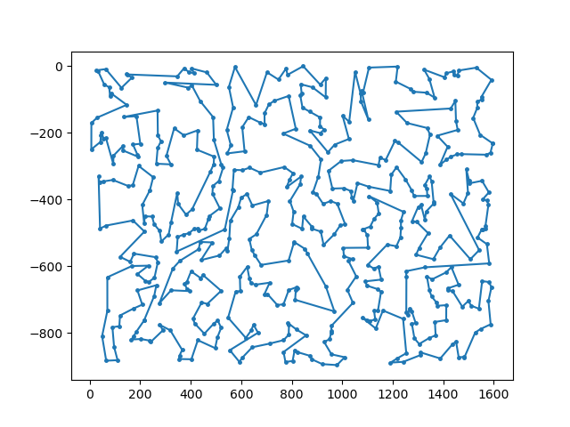

# TSP チェレンジ

## 方針
n × ｎ の領域に分けて、各領域で 貪欲法+2-opt法+焼きなまし法を適用し部分巡回路を計算する。

イメージ：

その後、巡回路同士を結合し、1つの巡回路にする。

イメージ：

## 実装
### 1. クラスタリング（make_clusters()）

都市を座標に基づいて n × n に分割し、各都市を対応する領域へ割り当てる。
具体的には、まず全体を x でソートして n 分割し、各サブセットを y でソートして更に n 分割する。

ただし、要素が 4 つ未満のサブセットができた場合、部分巡回路作成やクラスターの結合で不具合が生じないようにする。
（そもそも要素が少ないと領域分解の意味も薄れるので問題ない）

### 2. 部分巡回路の構築

#### a. 貪欲法（greedy()）
各領域内で最近傍貪欲法を用いて巡回路を作成する。現在位置から最も近い未訪問都市を順に選択し、全都市を訪問した後に始点へ戻る。

#### b. 2-optを用いた焼きなまし法による部分巡回路の改善（apply_2opt_with_sa()）

貪欲法で作成した巡回路には交差が含まれることがあるため、2-opt法によって改善する。

ランダムな 2 辺を選び、それを入れ替えた方が巡回路長が短くなる場合は入れ替え、そうでなくても一定確率 P で入れ替える。
P の計算法は焼きなまし法を用いた。

### 3. 巡回路の結合（joint_clusters()）

各領域で得られた部分巡回路同士を結合する。異なる巡回路に属する辺の組について、辺を繋ぎ替えたときの距離変化を計算し、巡回路長の増加が最も小さい組み合わせを選択する。これを繰り返して全ての巡回路を1つに統合する。

### 5. 全体処理（solve()）

以上の処理をまとめた流れは以下の通りである。

クラスタリング（make_clusters()）

各クラスタで貪欲法を実行（greedy()）

各クラスタに2-optを適用（apply_2opt_with_sa()）

クラスタ同士を結合（joint_clusters()）

これを、分割数 n を 1～9 の範囲で変化させながら行い、最も巡回路長が短い結果を出力した。

## 結果

| solver | N=5 | N=8 | N=16 | N=64 | N=128 | N=512 | N=2048 | N=8192 |
|--------|-----|-----|------|------|-------|-------|--------|--------|
| random | 3418.10 | 3832.29 | 5449.44 | 10519.16 | 12684.06 | 25331.84 | 49892.05 | |
| sa | 3291.62 | 3778.72 | 4494.42 | 8150.91 | 10675.29 | 21119.55 | 44393.89 | |
| my_best | 3291.62| 3778.72| 4494.42|  8163.41| 10528.75| 21476.6| 42925.01| 88136.14 |

## 考察、補足
make_clusters()の計算量は O(NlogN)。

全クラスターでの greedy()は、クラスター数を S として O(N^2 + (N/2)^2 + ... + (N/S)^2) より O(N)。

apply_2opt_with_sa()は、焼きなまし法の設定温度に依存した回数ループされており、今回は 1151287 回。
つまり全クラスターでのapply_2opt_with_sa()は O(S * 10^7)。

joint_clusters()は、O({1*(S-1) + 2*(S-2) + ... + (S-1)*1}*(N^2 / S^2)) より O(S*N^2)。

以上より、全体の計算量は  O(S*(N^2 + 10^7)) ほど。
